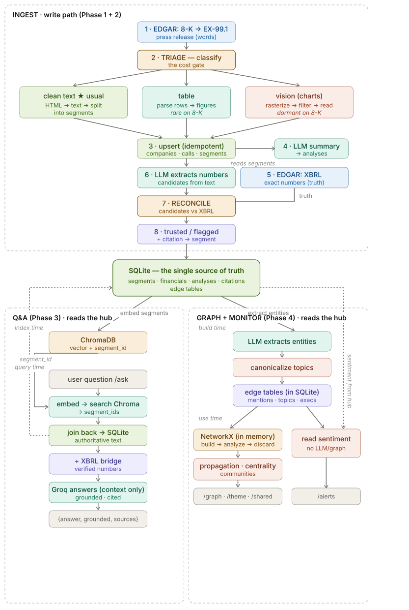
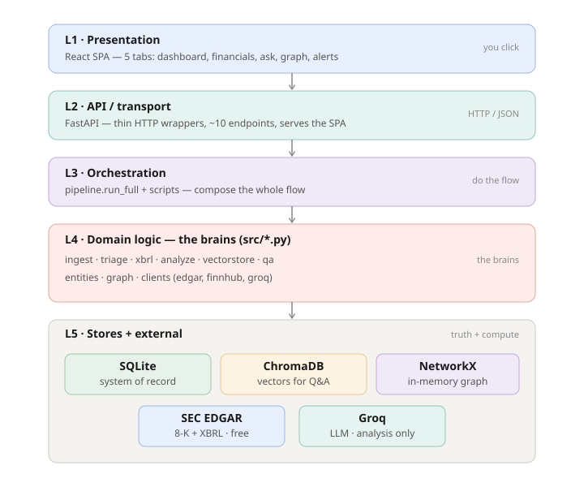
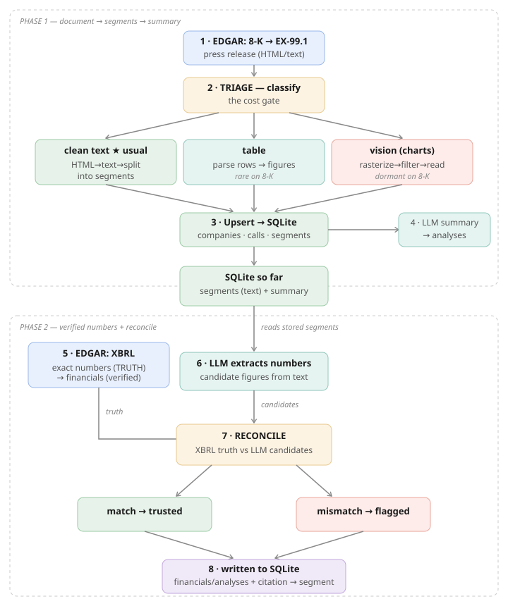
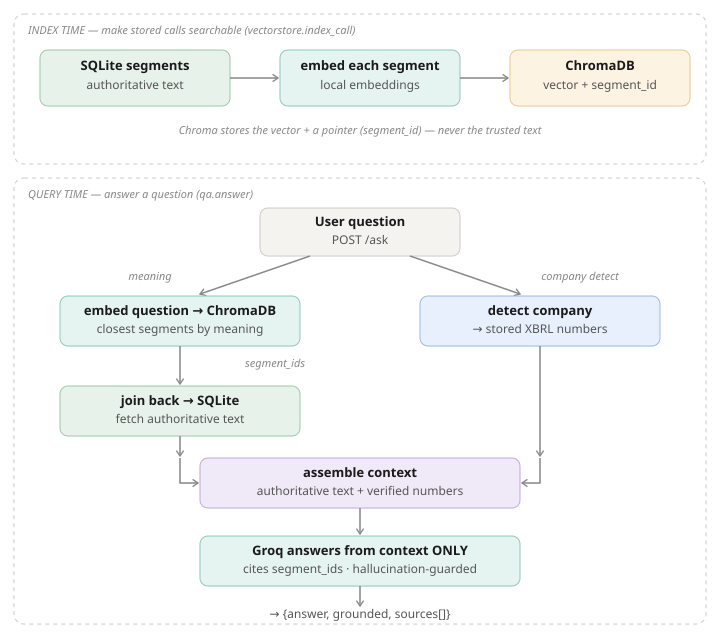
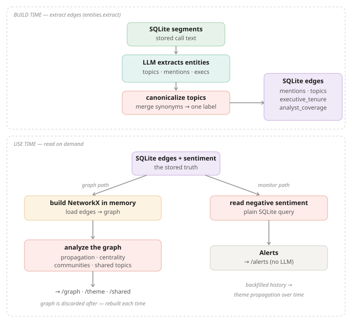
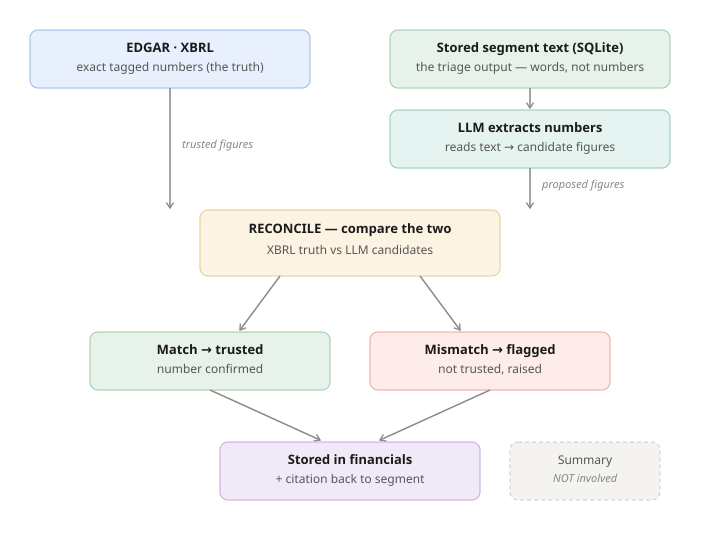

# Earnings Call Agent — Architecture

A personal/learning earnings-call agent built on a fully-local, fully-free stack.
This document is the single reference for how the system is structured and how data
moves through it.

## Two principles everything follows

1. **Numbers from structured data, meaning from the LLM.** Exact figures (revenue, EPS,
   guidance) come from SEC **XBRL** — deterministic, free, never hallucinated. The LLM
   (Groq) is used only for *interpretation*: summaries, sentiment, Q&A, entity
   extraction. It is never the authority on a number.

2. **Classify before you process.** A triage step inspects each document and routes it
   to the cheapest correct path, so the system never pays to run a vision model on
   something that doesn't need it. (Verified on a real Netflix 10-K: 122 pages, clean
   text layer, zero real charts — the "vector-heavy" pages were just tables. Vision
   would have cost ~5× more for worse accuracy.)

## The stack

| Concern | Tool | Role |
|---|---|---|
| System of record | **SQLite** | the single source of truth; one file on disk |
| Vector search | **ChromaDB** | semantic retrieval for Q&A; points back to SQLite |
| Graph analysis | **NetworkX** | in-memory, rebuilt from SQLite edges, then discarded |
| Filings + numbers | **SEC EDGAR** | 8-K press releases + XBRL (free, external) |
| LLM | **Groq** | analysis only (Llama-3.3-70b) |
| Calendar / profiles | **Finnhub** | earnings calendar, company data |
| Web framework | **FastAPI** | the API + serves the SPA |
| UI | **React SPA** | five tabs |

---

## 0. The whole system, connected (with the triage split)

Everything in one picture — external sources, the write/ingest path (including the
**triage split** that routes each document to text / table / vision), the three
stores, the read path, and the UI.



---

## 1. The five-layer map (system at rest)

Each layer only talks to the one directly below it. The UI never touches SQLite; the
API never calls EDGAR — every request travels down through L4, the only layer allowed
to touch the stores and external services.



- **L1 Presentation** — a React SPA with five tabs (dashboard, financials, ask, graph,
  alerts). All tabs stay mounted, so state persists across switches. The UI's entire
  world is HTTP calls to `/something`.
- **L2 API** — FastAPI, ~10 thin endpoints with no business logic. A routing table from
  URLs to L4 functions, plus JSON serialization. Also serves the SPA at `/`.
- **L3 Orchestration** — `pipeline.run_full` (the write-path sequence) plus the
  `scripts/` CLI entry points. Knows the *order* steps run in, not *how* they work.
- **L4 Domain logic** — the brains. The only layer with real internal structure and the
  only one that reaches across the local/external boundary in L5.
- **L5 Stores + external** — local stores (SQLite, ChromaDB, NetworkX) and external
  services (EDGAR, Groq). SQLite is the hub; the other two local stores are derived
  from it.

### L5 relationships
- **SQLite** is the only durable truth. Delete ChromaDB and NetworkX and you lose
  nothing real — both rebuild from SQLite. Delete SQLite and the system is gone.
- **ChromaDB** holds vectors + `segment_id` metadata. The ID is the join key back to the
  authoritative text in SQLite.
- **NetworkX** is built in memory from SQLite's edge tables on demand, queried, and
  thrown away. It stores nothing permanently.

---

## 2. Ingest write-path — Phases 1 & 2 (`pipeline.run_full`)

This runs when you ingest one company/quarter. EDGAR is hit twice (words early, numbers
later); the LLM is used twice but never as the authority; everything funnels into SQLite.



**Phase 1 — document → segments → summary**
1. **EDGAR fetch** — pull the latest 8-K (Item 2.02) and extract Exhibit 99.1, the
   earnings press release (the words).
2. **Triage** — classify the document. Three routes: *clean text* (★ the usual path for
   8-Ks), *table* (parse rows directly; rare), *vision* (rasterize → filter → interpret
   charts; dormant on text filings). The cost gate.
3. **Upsert → SQLite** — segmented text lands in `companies` / `calls` / `segments`.
   Idempotent via `UNIQUE(company, fiscal_year, quarter)`, so re-runs update rather than
   duplicate.
4. **LLM summary** — Groq reads the segments and writes a structured summary into
   `analyses` (stamped with `prompt_version`).

**Phase 2 — verified numbers + reconcile**
5. **EDGAR XBRL fetch** — exact, tagged numbers for the quarter → `financials`, marked
   verified (`source='xbrl'`). The *truth*.
6. **LLM extracts numbers** — Groq reads the *stored segments* and proposes candidate
   figures from the text.
7. **Reconcile** — compare XBRL truth against the LLM candidates (see §5). Match →
   trusted; mismatch → flagged.
8. **Write to SQLite** — results land in `financials` / `analyses`, each tied by
   citation back to its source segment.

### Triage routes: text, table, vision
- **clean text** — HTML → text → split into segments. Cheap, deterministic, the usual
  path.
- **table** — parse structured rows into figures. Cheap; occasionally triggers on an
  embedded results table.
- **vision** — rasterize the page, run a cheap "is this a real chart?" filter, send only
  keepers to a vision LLM for *interpretation* (not precise numbers). Expensive; on
  text-based EDGAR filings it essentially never fires. It exists for the *other* kind of
  input (glossy decks / chart-heavy PDFs).

Whichever route a number arrives by, it is still reconciled against XBRL. The route
changes *how a candidate was obtained*, never *who the authority is*.

---

## 3. Phase 3 — retrieval Q&A

Has two times: **index time** (make stored calls searchable) and **query time** (answer
a question). The LLM answers strictly from retrieved context and cites segment IDs.



**Index time** — each stored segment is embedded (local embeddings) and written to
ChromaDB as a vector + `segment_id`. Chroma never holds the trusted text, only a pointer.

**Query time** — the question splits two ways:
- *Left (meaning):* embed the question → ChromaDB returns the closest `segment_id`s →
  join back to SQLite for the authoritative text.
- *Right (numbers):* detect the company in the question → pull its stored XBRL figures
  (the "XBRL bridge").

Both converge into the context Groq is allowed to use, and it answers from that context
*only*, returning `{answer, grounded, sources[]}`. The `grounded` flag is honest about
whether stored data actually backed the answer.

> **Routing note.** `/ask` reads stored data only and never contacts EDGAR. The live
> `/lookup` path (financials tab) always contacts EDGAR and never reads stored data.
> The user chooses stored-vs-live implicitly by which tab they use; nothing inspects the
> question to decide. Getting a new/refreshed period in is an explicit **ingest**, not
> something a query does automatically.

---

## 4. Phase 4 — graph + monitoring

Also two times: **build time** (extract edges) and **use time** (read on demand).



**Build time** — the LLM reads stored segments, extracts topics / mentions / executives,
**canonicalizes topics** (merges synonyms like "AI capex" and "AI capital spending" into
one label), and writes rows into the SQLite edge tables (`mentions`, `topics`,
`executive_tenure`, `analyst_coverage`). `analyst_coverage` is partly free — derivable
from segments where the speaker role is "analyst" — but stays thin without transcripts.

**Use time** — the stored edges feed two independent consumers:
- *Graph path:* load edges into a **NetworkX graph built fresh in memory**, run
  propagation / centrality / community / shared-topic analysis, serve `/graph`,
  `/theme`, `/shared`, then discard the graph.
- *Monitor path:* read negative-sentiment rows straight from SQLite — no LLM, no graph
  build — and serve `/alerts`. The lightest read in the system.

Backfilled history is what makes the graph's *temporal* analysis (theme propagation over
time) meaningful — it only matters once multiple quarters are loaded.

### Reading an alert
An alert row like `NEG TOPIC · AMZN · FY2026Q2 · free cash flow · sentiment -1 · seg 7445`
means: on Amazon's FY2026 Q2 call, the free-cash-flow discussion was scored strongly
negative (-1, where -1 is most negative, -0.5 is moderate), grounded to segment 7445.
The same topic flagging negative across consecutive quarters is the real signal — a
persistent concern, not a one-off.

---

## 5. The reconcile step in detail

The single most important step for trustworthiness. It compares exactly two number
sources — both from the same call — and the summary is **not** involved.



- **Left (authority):** the exact XBRL figures from EDGAR.
- **Right (proposal):** the segment text → LLM extraction → candidate numbers. The text
  is one step *upstream* of the comparison, not a party to it; only the LLM's extracted
  numbers reach reconcile.
- **Match → trusted. Mismatch → flagged.** Both land in `financials`/`analyses` with a
  citation to the source segment.
- **The summary is a separate prose output and never enters reconcile.**

Roles of the three stored things:
- **segments** = the source the LLM reads (input to extraction)
- **summary** = a separate prose output (never reconciled)
- **financials** = where both the XBRL truth and the reconciled result are stored

---

## 6. Data model (SQLite)

```
companies ─1:N─ calls ─1:N─ segments ──────────────┐
                  │                                  │ segment_id is the
                  ├─1:N─ financials  (xbrl|spoken)   │ universal join key —
                  └─1:N─ analyses ─1:N─ citations ───┘ also used by ChromaDB
                                                        metadata + graph edges

Edge tables (Phase 4):
  topics   ─N:M (via mentions)─ calls/companies
  people   ─1:N─ executive_tenure ─ companies
  analysts ─ analyst_coverage ─ companies
```

ChromaDB rows store `segment_id` → join back to `segments`. NetworkX is built by reading
`mentions` / `topics` / `executive_tenure`, then discarded.

---

## 7. Build phases ↔ tools activated

```
P0 Setup        → SQLite                    schema + API clients + smoke test
P1 Summarize    → SQLite                    8-K → segments → Groq summary
P2 Financials   → SQLite                    XBRL truth + reconcile + sentiment + cites
P3 Q&A          → SQLite + ChromaDB         embed → retrieve → grounded answer
P4 Graph/Monitor→ SQLite + Chroma + NetworkX topics/execs → multi-hop graph + alerts
   + History      (backfill N quarters → theme propagation over time)
   + UI           (FastAPI + React)
```

## One-sentence mental model

SQLite is the hub of truth; everything else either writes into it (EDGAR + Groq via the
pipeline), reads from it (the API/UI), or is derived from it and thrown away (ChromaDB
vectors point back to it; the NetworkX graph is rebuilt from its edge tables on demand).
